# Table of Contents
 <p><div class="lev1 toc-item"><a href="#Advanced-Lane-Finding-Project" data-toc-modified-id="Advanced-Lane-Finding-Project-1"><span class="toc-item-num">1&nbsp;&nbsp;</span>Advanced Lane Finding Project</a></div><div class="lev2 toc-item"><a href="#Goals" data-toc-modified-id="Goals-11"><span class="toc-item-num">1.1&nbsp;&nbsp;</span>Goals</a></div><div class="lev1 toc-item"><a href="#Rubric" data-toc-modified-id="Rubric-2"><span class="toc-item-num">2&nbsp;&nbsp;</span>Rubric</a></div><div class="lev2 toc-item"><a href="#Writeup-/-readme" data-toc-modified-id="Writeup-/-readme-21"><span class="toc-item-num">2.1&nbsp;&nbsp;</span>Writeup / readme</a></div><div class="lev2 toc-item"><a href="#Camera-calibration" data-toc-modified-id="Camera-calibration-22"><span class="toc-item-num">2.2&nbsp;&nbsp;</span>Camera calibration</a></div><div class="lev2 toc-item"><a href="#Pipeline-(single-images)" data-toc-modified-id="Pipeline-(single-images)-23"><span class="toc-item-num">2.3&nbsp;&nbsp;</span>Pipeline (single images)</a></div><div class="lev1 toc-item"><a href="#Pipeline-(video)" data-toc-modified-id="Pipeline-(video)-3"><span class="toc-item-num">3&nbsp;&nbsp;</span>Pipeline (video)</a></div><div class="lev1 toc-item"><a href="#Discussion" data-toc-modified-id="Discussion-4"><span class="toc-item-num">4&nbsp;&nbsp;</span>Discussion</a></div>

# Advanced Lane Finding Project

[Rubric](https://review.udacity.com/#!/rubrics/571/view)  
[Template](https://github.com/udacity/CarND-Advanced-Lane-Lines/blob/master/writeup_template.md)

---
## Goals

* Compute the camera calibration matrix and distortion coefficients given a set of chessboard images.
*  Apply a distortion correction to raw images.
* Use color transforms, gradients, etc., to create a thresholded binary image.
* Apply a perspective transform to rectify binary image ("birds-eye view").
* Detect lane pixels and fit to find the lane boundary.
* Determine the curvature of the lane and vehicle position with respect to center.
* Warp the detected lane boundaries back onto the original image.
* Output visual display of the lane boundaries and numerical estimation of lane curvature and vehicle position.

---
# Rubric

Here I will consider the rubric points individually and describe how I addressed each point in my implementation.

---
## Writeup / readme
>A)  Provide a Writeup / README that includes all the rubric points and how you addressed each one.

You're reading it!

---
## Camera calibration

>A) Briefly state how you computed the camera matrix and distortion coefficients. Provide an example of a distortion corrected calibration image.

See __section 1__ of the IPython notebook located in "./detailed_process.ipynb". The section is divided in 4 parts:

- 1.1 Load images
- 1.2 Compute camera matrix and distortion coefficients using a custom function `calibrate_camera` stored in `func_calibration.py`. Code followed by explanation of function.
- 1.3 Save camera matrix and distortion coefficient to pickle
- 1.4 Plot example of undistorted chessboard

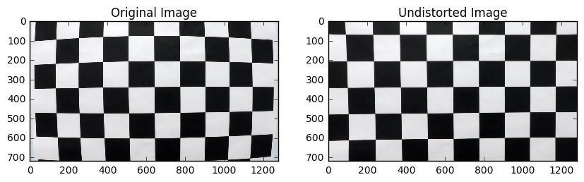


---
## Pipeline (single images)

>A. Provide an example of a distortion-corrected image.

See __section 2.1__ of `detailed_process.ipynb`. The image is undistorted using `cv2.undistort()`in combination with mtx and dist previously computed in calibration step.


```python
# Read lane image
original_img = cv2.imread('data/test_images/straight_lines1.jpg')
img = cv2.undistort(original_img, mtx, dist, None, mtx)
img_rgb = pj.bgr_to_rgb(img)

plt.imshow(img_rgb)
plt.title('undistorted image');
```


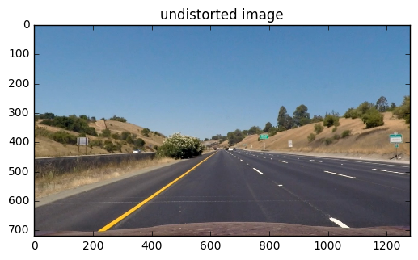


---
> B. Describe how (and identify where in your code) you used color transforms, gradients or other methods to create a thresholded binary image. Provide an example of a binary image result.

See section 2.2 of of `detailed_process.ipynb`. Example of binary image result provided in 2.2.1 of of `detailed_process.ipynb`

Resulting combined binary is obtained keeping ones from absolute value thresholded image and s_channel thresholded image and removing pixels that not pass the direction/angle threshold.

Example:
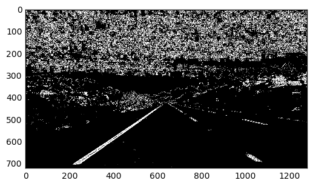

---
>C. Describe how (and identify where in your code) you performed a perspective transform and provide an example of a transformed image.

See section 2.3 of of `detailed_process.ipynb`. Main steps:
- Compute transformation matrices (direct and inverse) and source/destination points (section 2.3.1). Method: After choosing 4 poing in image that delimitate a plane, use custom function `perspective_transform` to compute transformation matrices (direct and inverse). Also return source and destination points.
- Apply transformation to new image: using custom function `apply_transform` (see section 2.3.2)

I verified that my perspective transform was working as expected by drawing the src and dst points onto a test image and its warped counterpart to verify that the lines appear parallel in the warped image.
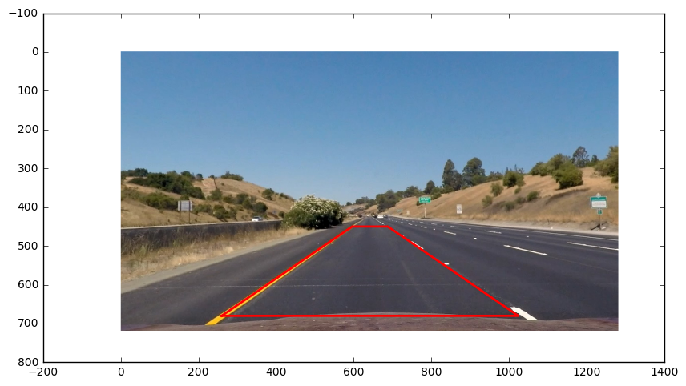
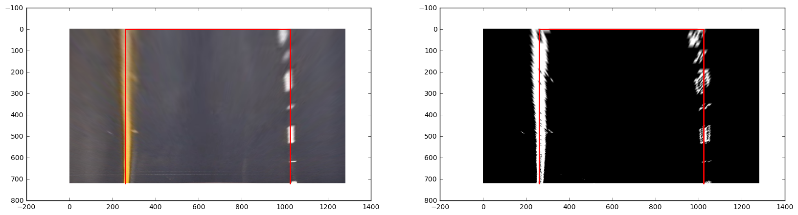


---
>D. Describe how (and identify where in your code) you identified lane-line pixels and fit their positions with a polynomial?

See section 2.4 of `detailed_process.ipynb`. Steps:

__LANE PIXELS DETECTION__
- Detect lane pixels (section 2.4.1) using `detect_lane_line_pixels` function (lines 78 to 115 of `func_detect.py`)
    - Use histogram to identify starting point in base of image using auxiliar function `locate_with_histogram` (lines 57 to 76 of `func_detect.py`. Argument plots=True prints plots, img_use=0.5 specifies lower fraction of image to use.
    - Use `_locate_all_windows` function to locate pixels in up-sliding windows. As input accepts pixel at base detected using histogram.  
    - If 'plots=True', print plots. Used while parameter tunning

Histogram image:

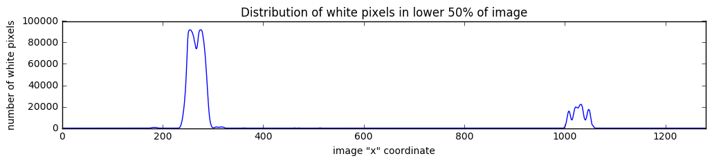

Detected pixels image:

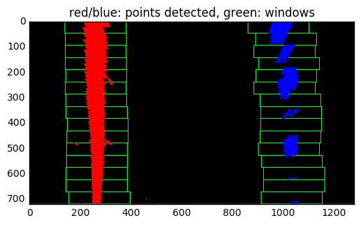


__POLYNOMIAL ADJUSTMENT AND CURVATURE__

- Fit my lane lines with a 2nd order polynomial (section 2.4.2). Polynomial coefficients are computed using `np.polyfit()` and radious computed using formula:
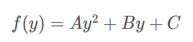
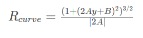

Example:
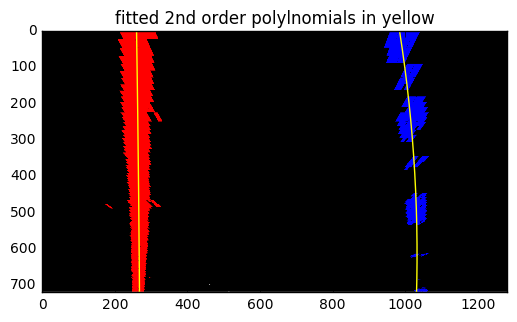

---
> E. Describe how (and identify where in your code) you calculated the radius of curvature of the lane and the position of the vehicle with respect to center.

Radious of curvature computed for left and right lanes in previous section (see 2.4.2 of `detailed_process.ipynb`). Final curve is mean value for both lanes ratious.

Offset: see section 2.4.3. Offset computed using `compute_vehicle_offset` (lines 167 to 173 of `func_detect.py`). Basically consist on taking x values of lane at base of image and compute desviation from center of image (assumed is center of car)

> F. Provide an example image of your result plotted back down onto the road such that the lane area is identified clearly.

See section 2.5 of `detailed_process.ipynb`. 
* Lane painted in binary image using `paint_lane`(defined in lines 175 to 190 of `func_detect.py`). 
* Then, unwarp image using `cv2.warpPerspective` and merge into original image using `cv2.addWeigthed`
* No undistort step done  (not deemed necessary for visualization)
* Add annotation in final image of radious and offset values, using `plt.text()`

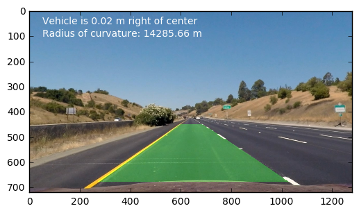

# Pipeline (video)

>A. Provide a link to your final video output. Your pipeline should perform reasonably well on the entire project video (wobbly lines are ok but no catastrophic failures that would cause the car to drive off the road!)

My video is stored in `output_video` folder as `project_video_processed.mp4`.

Video is obtained applying the `process_image` custom function (defined in lines 18 to 91 of `final_pipeline.py`). Is just a wrapper for the previous steps.

Video created in section 4 of `detailed_process.ipynb`

# Discussion
> Briefly discuss any problems / issues you faced in your implementation of this project. Where will your pipeline likely fail? What could you do to make it more robust?

Basically my strategy has been to join all parts presented in lessons and use lots of plots to 'see' what was going on and adjust.

This proved especially usefull in thresholding part, in which by visualizing output of different thresholds and visualizing them I came up with a good enough combination of thresholds.

Regarding video, I saved frames in which my pipeline was performing poorly and fine-tuned my pipeline. This may be problematic in the sense that by adjusting my pipeline to a good performance in given video, __I may be overfitting__ and my pipeline may not generalize well enough.

S channel proved to be very good for detecting lane, but to give it more robustness it is combined with  gradient information (absolute value and direction). This allowed to lower S threshold to capture most lanes 'cleaning' afterwards lanes with not good enough direction/gradient. I had to play a bit with kernels to clean noise.

Regarding lane detection, by adjusting width and height of sliding windows my pipe detected lines well enough. Nevertheless, for future improvement of this pipe, I would explore use a convolutional approach and also use info from previous frame (as suggested by lesson regarding usage of left/right lane class).


Here I'll talk about the approach I took, what techniques I used, what worked and why, where the pipeline might fail and how I might improve it if I were going to pursue this project further. 


```python

```
